<!-- Divyansh GitHub Profile -->
<div align="justify">

<!-- Profile -->
<p align="left"><strong><samp><i>「</i></samp></strong></p>
  <p align="center">
    <samp>
      <b>
        <div align="center">
           <a href="https://git.io/typing-svg"></a>
          </a>
      </b>
      <br>
        Meraki in the process. Meaning in the pursuit. Following curiosity beyond the beaten path.
      </br> 
      <br>
      <b>
        ~ Divyansh Dishu (@singhdivyanshdishu)
      </b>
      </p>
    </samp>
  </p>
<p align="right"><strong><samp><i>」</i></samp></strong></p>
</div>
                
```python

           .             ​ dishu@ghostos
          .c.           ┌──────────────────────────────────┐ 
         .ccc.           ​ OS     : GHOST OS 
        .lllll.          ​ Kernel : NERD-DEV 3.14 
       ..;'olll.         ​ WM     : Niri 
      .dolllcccl.        ​ Shell  : fish
     .lcc'   'ccc.       ​ Uptime : 23 years
    .ccc'     'cc:.      ​ CPU    : NeuraCore AX-1
   .cccc'     'c:;..    └──────────────────────────────────┘ 
  ."'             '".     D   I   V   Y   A   N   S  H   火

dishu@ghostos:~$
```
```javascript
dishu@ghostos:~$ pwd
/home/divyansh
dishu@ghostos:~$ ls
Downloads     Documents     Notes
Pictures      Projects      GitHub
dishu@ghostos:~$
dishu@ghostos:~$ cd Documents
dishu@ghostos:~/Documents$ ls
divyansh.cpp  resume.pdf    goals.md
bookshelf.txt       
```
```javascript
dishu@ghostos:~/Documents$ cat divyansh.cpp
class Divyansh {
public:
    std::string role =
        "Computer Science Graduate";

    std::vector<std::string> interests = {
    "Linux",
    "C++",
    "Competitive Programming",
    "Chess",
    "Anime",
    "Building Things From Scratch"
};

    std::vector<std::string> currently_learning = {
           "Systems Programming",
           "Competitive Programming",
           "Implementing Theory Into Practice"
    };

    std::string current_project =
        "codecrafters_shell_cpp";

    std::string philosophy =
        "Meraki in the process. Meaning in the pursuit.";
};

```
```javascript
dishu@ghostos:~/Documents$ cd ~
dishu@ghostos:~$ pwd
/home/divyansh
dishu@ghostos:~$ cd GitHub
dishu@ghostos:~/GitHub$ ls
analytics    repositories    competitive-programming
dishu@ghostos:~/GitHub$ cd competitive-programming
dishu@ghostos:~/GitHub/competitive-programming$ ls
leetcode    codeforces
dishu@ghostos:~/GitHub/competitive-programming$ fetch codeforces && leetcode
```
[](https://codeforces.com/profile/singhdishuryuk)


```javascript
dishu@ghostos:~/GitHub/competitive-programming$ cd ..
dishu@ghostos:~/GitHub$ cd repositories
dishu@ghostos:~/GitHub/repositories$ ls
codecrafters_shell_cpp    Diagnosing-Diabetic-Retinopathy-using-CNN
dishu@ghostos:~/GitHub/repositories$ cat codecrafters_shell_cpp.repo
Repository : codecrafters_shell_cpp
Language   : C++
Domain     : Systems Programming
Focus      : POSIX Shell Implementation
Status     : Active
Features:
- Custom shell REPL
- Builtin commands (cd, pwd, echo, type)
- External command execution
- Command parsing and tokenization
- PATH resolution
dishu@ghostos:~/GitHub/repositories$ cat Diagnosing-Diabetic-Retinopathy-using-CNN.repo
Repository : Diagnosing-Diabetic-Retinopathy-using-CNN
Language   : Python
Domain     : Deep Learning / Computer Vision
Focus      : Automated Diabetic Retinopathy Detection
Status     : Completed
Features:
- CNN-based image classification
- Retinal fundus image preprocessing
- Data augmentation pipeline
- TensorFlow / Keras implementation
- Diabetic Retinopathy severity prediction
```
```python
dishu@ghostos:~/GitHub/repositories$ cd ..
dishu@ghostos:~/GitHub$ cd analytics
dishu@ghostos:~/GitHub/analytics$ ls
contributions    stats      languages
streak           metrics    snake
dishu@ghostos:~/GitHub/analytics$ fetch contributions
dishu@ghostos:~/GitHub/analytics$ fetch stats
dishu@ghostos:~/GitHub/analytics$ fetch streak
dishu@ghostos:~/GitHub/analytics$ fetch languages
```
[](https://github.com/singhdivyanshdishu)


```python
dishu@ghostos:~/GitHub/analytics$ fetch snake
dishu@ghostos:~/GitHub/analytics$ fetch metrics
```




```python
dishu@ghostos:~/GitHub/analytics$ cd ~
dishu@ghostos:~$ pwd
/home/divyansh
dishu@ghostos:~$ sudo shutdown now
```

